<h3 align="center">THE FILE</h3>

Top-Rated freelancer on Upwork. I take the hard jobs: the ones with real stakes and no easy way in. 
3+ years of Python. I work as a mid-level software engineer and backend developer, 
building systems that are reliable, scalable and secure, and I deliver clean, well-structured work.

<h3 align="center">THE TRADE</h3>

<table align="center">
  <tr><td>Cybersecurity</td><td>Penetration Testing</td></tr>
  <tr><td>Reverse Engineering</td><td>Web Application Security</td></tr>
  <tr><td>Automation and Scripting</td><td>Backend Development (Python)</td></tr>
</table>

<h3 align="center">THE TOOLS</h3>

LANGUAGES 

  
BACKEND 

  
FRONTEND AND APPS 

  
DATA 

  
CLOUD AND OPS 

<h3 align="center">THE HIT LIST</h3>

<h3 align="center">REACH OUT</h3>

  

